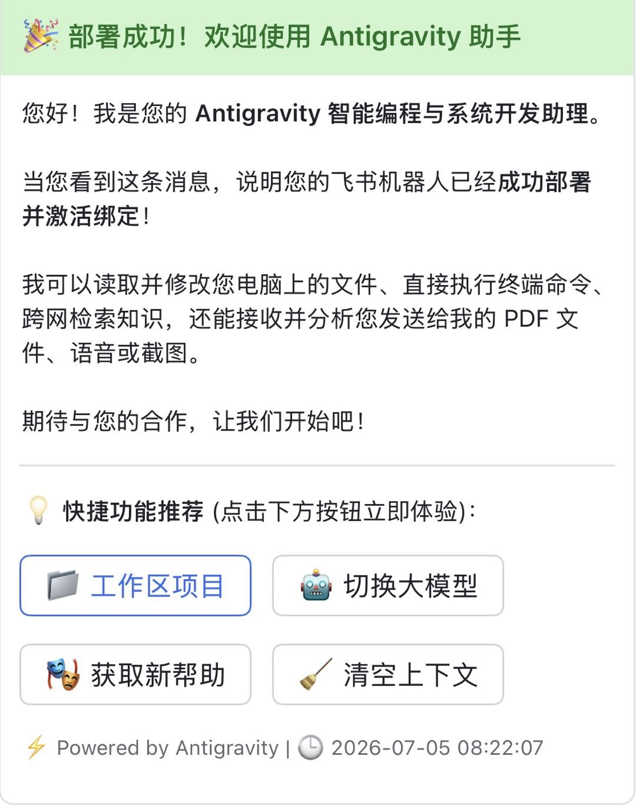
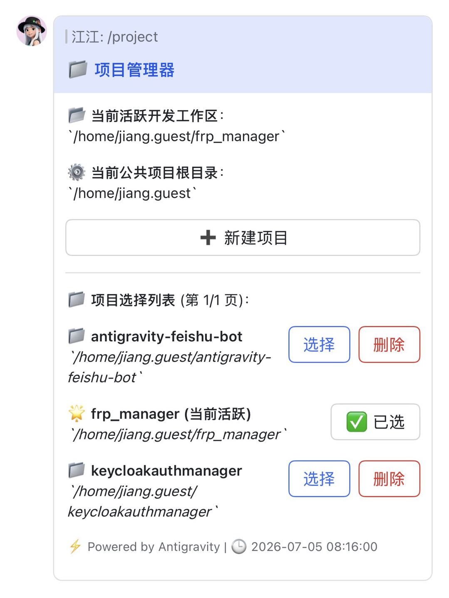
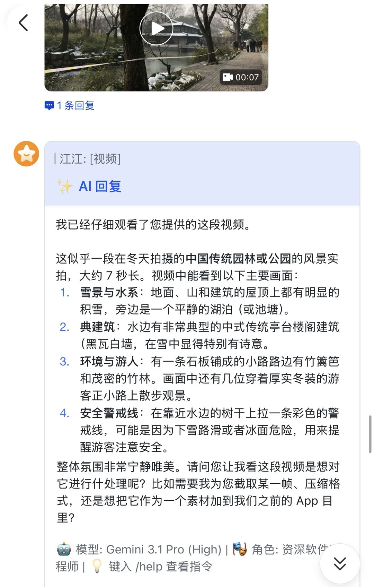
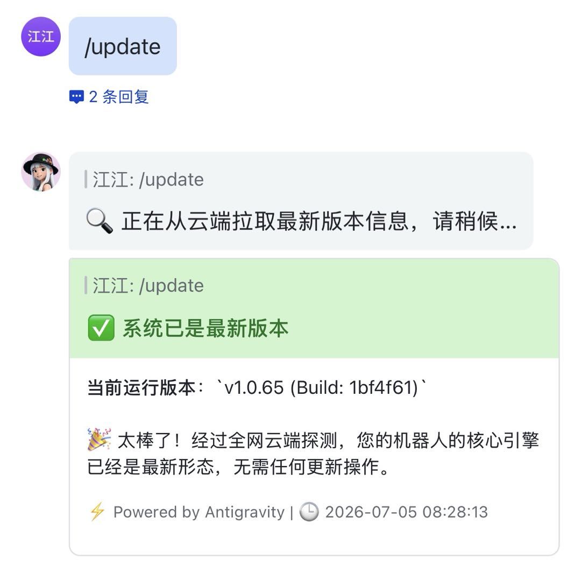

# Codex Feishu Bot

基于**飞书原生 WebSocket 长连接**与**本地 Codex CLI** 深度结合的智能助手。把大模型的代码辅助、系统操作、定时任务与插件能力接入飞书聊天窗口，提供全天候的远程开发与自动化支持。

> 当前基线：`v1.0-freeze-base`（2026-08-12 功能冻结）。已包含权限体系、定时任务、插件框架、AI 记忆、备忘录、服务器巡检、OTA 热升级等完整能力。

---

## 📸 界面预览

| 首次部署欢迎与快捷引导 | 交互式工作区项目管理器 | 实时动作与工具耗时指示 |
| :---: | :---: | :---: |
|  |  |  |

| 视频多模态深度解析 | 生成物自动捕获与回传 | 系统 OTA 自我热升级 |
| :---: | :---: | :---: |
|  |  |  |

---

## 🌟 核心功能

### 一、对话与多模态
- **流式状态卡片**：基于飞书 Interactive Card，Token 防抖队列平滑刷新，实时展示 `📥 资源加载中...`、`🛠️ 当前动作：执行命令`、`✨ AI 思考中...`。
- **文档解析**：Word / PDF / TXT / Markdown 自动下载并提取文本供模型分析。
- **图片视觉**：图片/截图可直接理解画面内容或识别代码。
- **音视频处理**：`.mp4` / `.mov` / `.ogg` 等音视频自动提取内容特征与摘要。
- **生成物回传**：模型生成的代码文件/图表自动作为飞书附件回传。
- **原生互动按钮**：模型需要确认时，自动在卡片渲染按钮（`CHOICE_CARD`），点击即可完成选择。
- **多图防抖合流**：连续多张图片自动合并为一次分析，避免碎片化消耗。

### 二、权限与安全（v3）
- **管理员引导**：首个会话（私聊或群聊，见 `AUTH_BOOTSTRAP_ALLOW_GROUP`）自动绑定为管理员。
- **完整角色体系**：`admin / user / guest / banned` + 授权作用域（basic / dev / full）。
- **未授权静默**：未授权会话仅可发送 `/auth` 申请，不会触发 AI 调用。
- **限流**：普通用户消息频率限制（默认 5 条/分钟）。
- **沙箱联动**：管理员任务 `danger-full-access`，普通用户强制 `workspace-write` 受限沙箱。
- **命令管理**：`/user` 面板支持授权 / 撤销 / 拉黑 / 提升 / 降级 / 重新绑定管理员。

### 三、定时任务（v3）
- `/cron` / `/schedule` 打开计划任务中心：标准 Cron 表达式或秒级倒计时（如 `600s`、`10m`）。
- 面板支持创建、启停、删除、立即触发；执行结果以报告卡片推送。
- 定时任务使用**独立会话副本 + 全新线程**执行，不污染用户对话上下文。

### 四、插件生态（v3）
微内核插件框架，支持本地加载与 GitHub 在线安装（`/plugin` 面板）。内置 6 个插件：

| 插件 | 命令 | 能力 |
|---|---|---|
| 🧠 ai_memory | `/memory` | 长期偏好管理，对话前自动注入偏好上下文 |
| ⏱️ cron_scheduler | `/cron` `/schedule` | 定时任务面板（由系统命令优先处理） |
| 📝 notes_manager | `/note` `/notes` | 备忘录：添加 / 列表 / 详情 / 删除 / 清空 |
| 🖥️ server_health | `/sysinfo` `/health` | CPU / 内存 / 磁盘 / 运行时长巡检卡片 |
| 🍓 rpi_gpio_status | `/light` `/led` | 树莓派三色 LED 状态灯（非树莓派自动 Mock 降级） |
| 🔄 system_updater | `/update` | OTA 检查与热升级（由系统命令优先处理） |

### 五、本地执行引擎与运维
- **宿主机操作**：模型可直接读写宿主机文件、执行 Shell 命令（`npm run build`、`git clone`、`pm2 restart` 等），日志实时回流飞书。
- **OTA 热升级**：`/update` 探测云端版本，`/update confirm` 自动拉取代码、更新依赖并经 PM2 原地重启。
- **优雅停机**：捕获 `SIGINT/SIGTERM`，重启前自动清理大模型子进程与排队任务。
- **会话线程自愈**：检测到 Codex 会话线程损坏（工具输出丢失）时自动清空会话并以新线程重试一次。

---

## ⌨️ 命令速查

| 命令 | 说明 |
|---|---|
| `/help` | 帮助菜单（卡片按钮） |
| `/model` | 模型切换面板（`CODEX_MODELS` 自定义候选） |
| `/context` | 上下文 Token 用量看板 |
| `/quota` | Codex 官方订阅额度与账号查询 |
| `/brain` | 查看全局记忆库（`~/.codex/AGENTS.md`） |
| `/project` | 工作区项目浏览器：切换目录 / 设定公共根目录 / 新建项目 |
| `/status` | 系统状态：CPU / 内存 / 版本 / Git 摘要 |
| `/clear` | 清空当前会话上下文与 Token 统计 |
| `/stop` | 强制中断当前任务并清空排队请求 |
| `/auth` | 授权申请（未授权会话） |
| `/user` | 权限管理面板与子命令（grant / revoke / ban / promote / demote / reset-admin） |
| `/cron` `/schedule` | 定时任务中心 |
| `/plugin` `/plugins` | 插件中心与商店 |
| `/note` `/notes` | 备忘录（`/note add <内容>`、`/note del <编号>`、`/note clear`） |
| `/memory` | 长期偏好记忆管理 |
| `/ping` | 心跳自检 |
| `/sysinfo` `/health` | 服务器巡检卡片 |
| `/light` `/led` | 树莓派 GPIO 状态灯控制台 |
| `/update` | 检查更新；`/update confirm` 热升级 |

> 规则：**系统命令优先**，插件注册的同名命令作为兜底，不会重复处理。

---

## 🛡️ 飞书后台配置（一次性）

部署前需要在[飞书开放平台](https://open.feishu.cn/)完成应用创建与权限配置：

1. **创建应用**：进入「开发者后台 → 创建企业自建应用」，获取 `App ID` 与 `App Secret`，
   填入 `.env` 的 `FEISHU_APP_ID` / `FEISHU_APP_SECRET`。
2. **开通权限**：在「权限管理」中为应用添加以下权限：

| 权限 | 用途 |
|---|---|
| `im:message` | 接收与发送消息 |
| `im:message:resource` | 下载消息中的图片 / 文件资源 |
| `im:image` | 上传并发送图片 |
| `im:file` | 上传并发送文件（生成物回传） |
| `im:message.reaction` | 消息表情回复 |
| `im:chat:readonly` | 读取群聊基本信息 |
| `contact:user.base:readonly` | 读取用户基本信息（权限引导） |

3. **事件订阅**：在「事件与回调」中订阅以下事件（长连接模式自动生效，无需公网回调地址）：
   - `im.message.receive_v1`（接收消息）
   - `card.action.trigger`（卡片按钮交互）
4. **发布版本**：在「版本管理与发布」中创建版本并发布，可用范围至少包含
   需要使用的成员或群组（建议设为「所有成员」或按需勾选）。

> 长连接（WebSocket）模式无需配置「回调地址」与「加密策略」；本程序使用飞书
> 原生长连接 SDK，事件自动推送，不依赖公网 IP 或反向代理。

---

## 🚀 安装部署

### 系统要求
- Python 3.10+
- Node.js 与 npm（仅用于安装 PM2）
- Codex CLI（已安装并完成 `codex login`）

### 支持平台

| 平台 | 方式 | 说明 |
|---|---|---|
| macOS 12+ | 一键脚本 / 手动 | 自动使用 Homebrew + 用户级 npm，免 sudo |
| Debian / Ubuntu | 一键脚本 / 手动 | `apt-get` 自动安装依赖 |
| Fedora / RHEL | 一键脚本 / 手动 | `dnf` / `yum` 自动安装依赖 |
| Arch Linux | 一键脚本 / 手动 | `pacman` 自动安装依赖 |
| Alpine Linux | 一键脚本 / 手动 | `apk` 自动安装依赖 |
| 任意平台 | Docker | 容器内运行，数据目录挂载持久化 |

> 树莓派（Raspberry Pi OS）默认作为 Linux 平台部署；GPIO 状态灯是可选的
> **插件**（`rpi_gpio_status`），非树莓派环境自动降级为模拟日志模式，不影响其他功能。

### 一键部署（最推荐）
```bash
bash <(curl -sL https://raw.githubusercontent.com/Level6me/codex-feishu-bot/main/install.sh)
```
脚本自动检测操作系统与包管理器，克隆源码、引导填写飞书凭证、安装/检测 Codex CLI、
创建虚拟环境、安装依赖并启动 PM2 服务；macOS 使用用户级 npm 目录（免 sudo），
Linux 各发行版按 `apt-get / dnf / yum / pacman / apk` 自动适配。

### 手动部署
```bash
git clone https://github.com/Level6me/codex-feishu-bot.git
cd codex-feishu-bot

python3 -m venv venv
source venv/bin/activate
pip install -r requirements.txt

cp .env.example .env
# 编辑 .env，填入 FEISHU_APP_ID / FEISHU_APP_SECRET 等配置

pm2 start venv/bin/python3 --name "codex-feishu-bot" -- main.py
pm2 save
```

### 常用运维
```bash
pm2 logs codex-feishu-bot   # 实时日志
pm2 restart codex-feishu-bot
pm2 stop codex-feishu-bot
```

### 向飞书会话发送文件
```bash
# 自动定位最近活跃会话，把本地文件（文档/图片/压缩包等）发到飞书
venv/bin/python3 send_to_feishu.py docs/FLIGHT_CHECK.md

# 指定会话并附带说明文字
venv/bin/python3 send_to_feishu.py report.pdf oc_xxxx --caption "这是验收报告"
```

### 容器部署（Docker）
```bash
# 1. 准备环境变量（飞书凭证等）
cp .env.example .env && vi .env

# 2. 确保 Codex CLI 登录态挂载目录存在（登录过 codex 即存在）
ls ~/.codex

# 3. 启动（自动构建镜像；数据目录 data/ 与 downloads/ 自动创建）
docker compose up -d --build

# 4. 查看日志 / 停止
docker compose logs -f
docker compose down
```

> 说明：镜像内运行 `python3 main.py`，DB 持久化在宿主 `./data/`（通过 `DB_FILE` 环境变量），
> 媒体下载在 `./downloads/`，Codex 登录态 `~/.codex` 只读挂载进容器。

---

## ⚙️ 配置项（.env）

| 变量 | 默认 | 说明 |
|---|---|---|
| `FEISHU_APP_ID` / `FEISHU_APP_SECRET` | - | 飞书应用凭证（也兼容 `APP_ID` / `APP_SECRET`） |
| `ALLOWED_USERS` / `ALLOWED_CHATS` | 空 | 白名单（逗号分隔），命中自动入册 dev 角色 |
| `DANGEROUSLY_SKIP_PERMISSIONS` | `true` | 跳过权限门禁（单用户自部署）；多人环境请设为 `false` |
| `AUTH_BOOTSTRAP_ALLOW_GROUP` | `true` | 允许首个群聊绑定管理员；`false` 时仅私聊可绑定 |
| `AGENT_BACKEND` | `codex` | 后端类型 |
| `CODEX_BIN` | `codex` | Codex 可执行文件路径 |
| `CODEX_MODEL` | 空 | 默认模型覆盖（`--model` 参数） |
| `CODEX_MODELS` | 官方默认列表 | `/model` 面板候选模型（逗号分隔） |
| `WORKSPACE_ROOT` | `~` | 项目浏览器默认根目录 |
| `GIT_MIRROR_URL` | 空 | OTA 更新第一备选镜像 |
| `GITEE_MIRROR_URL` | 空 | OTA 更新第二备选镜像 |

---

## 🧱 项目结构

```
├── main.py               # 飞书 WS 入口、事件分发、队列与心跳
├── agent_executor.py     # Codex CLI 适配：执行、流式卡片、线程自愈
├── commands.py           # 系统斜杠命令路由
├── card_builder.py       # 全部交互卡片构建
├── lark_client.py        # 飞书 API 封装
├── database.py           # SQLite 持久层（8 张表）
├── config.py             # pydantic-settings 配置
├── cron_engine.py        # 定时任务调度引擎
├── plugin_manager.py     # 插件加载与分发
├── plugin_base.py        # 插件基类
├── plugin_store.py       # 在线插件源
├── plugins/              # 6 个内置插件
├── utils/                # auth（权限）、retry 等
└── multimodal.py         # 多模态文件解析
```

## 💾 数据持久化
全部状态存于本地 `codex_bot.db`（SQLite WAL 模式）：
`chat_sessions`、`user_profiles`、`bot_meta`、`auth_sessions`、`pending_tasks`、`cron_tasks`、`cron_logs`、`recent_messages`。

---

## 🧪 自动化测试

内置 unittest 测试套件（零第三方依赖），覆盖：系统命令、插件、卡片按钮分发、
卡片构建快照（38 方法基线对比）、媒体解析（图片/富文本/链接/文件/音视频/批量）、
权限门禁（引导/角色/申请/限流/访客静默）、沙箱联动（admin=full / user=workspace）、
执行器修复（线程自愈/定时任务隔离）、`/stop` 中断、定时任务生命周期（共 42 项）。

```bash
cd codex-feishu-bot
venv/bin/python3 -m unittest discover -s tests -v
```

> 所有测试 mock 飞书发送 / Codex CLI 子进程 / git fetch；数据库通过 `DB_FILE`
> 环境变量隔离到临时目录，**不会触碰真实 `codex_bot.db`**。
> 卡片基线位于 `tests/baseline/cards_baseline.json`，卡片输出变更时用
> `python3 -m tests.test_cards_snapshot --gen` 重新生成后人工确认再提交。

---

## 📋 功能冻结与回归

- 冻结基线标签：`v1.0-freeze-base`
- 回归验收清单：见 [REGRESSION_CHECKLIST.md](REGRESSION_CHECKLIST.md)
- 飞书端交互点验手册：见 [FLIGHT_CHECK.md](docs/FLIGHT_CHECK.md)
- 迁移与演进记录：见 [MIGRATION.md](MIGRATION.md) / [CHANGELOG.md](CHANGELOG.md)

冻结期纪律：只修 bug、不加新功能；每次改动小步验证，全量回归通过后才允许上线。
